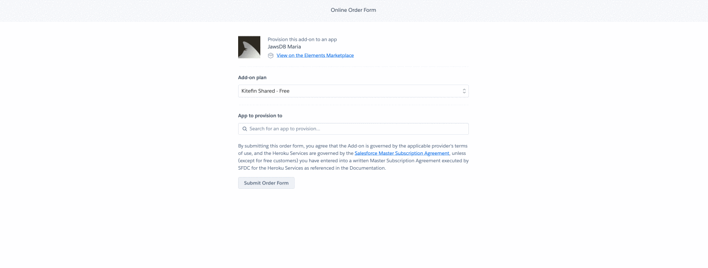

# Connecting to a SQL database from Python

## Parte 1: Crear una base de datos en la nube usando Heroku

1. Crea una cuenta en heroku.com.
2. Inicia sesión en tu cuenta de heroku.
3. Crea una [nueva aplicación](https://dashboard.heroku.com/new-app).
4. Busque los "complementos" de la aplicación en [el Heroku Marketplace]( https://elements.heroku.com/addons), la base de datos MySQL será un "complemento" para tu aplicación.
5. Busca el complemento [JawDB Maria DB](./assets/jawdb.png) y ábrelo haciendo clic en él.
6. Una vez que estés en la [página de destino oficial del complemento JawDB / MariaDB](https://elements.heroku.com/addons/jawsdb-maria), instala JawDB [en tu aplicación](./assets/mariadb.png), elije el `Plan gratuito` y busca tu aplicación.

7. Espera un par de segundos, una vez que esté instalado, ve a la pestaña de recursos de tu proyecto y el servicio JawDB MariaDB debería aparecer allí como "complemento instalado".

8. Haz clic en el complemento `JawDB Maria` y te mostrará las credenciales de tu base de datos.
9. Esta es una muestra de [cómo se verán las credenciales de tu base de datos](./assets/JawsDB.png).

## Parte 2: Comprende la estructura de la plantilla de tu proyecto

Se ha creado tu base de datos SQL, pero aún no hay tablas. Se conectará a tu base de datos MariaDB vacía y creará algunas tablas desde Python utilizando scripts SQL que ya te hemos proporcionado dentro de la carpeta `./src/sql/`:

- `./src/sql/create.sql` con todas las tablas que necesitas crear. Manos en la creación de esas tablas.
- `./src/sql/insert.sql` con todos los valores de la tabla que se insertarán en cada tabla.
- `./src/sql/drop.sql` contiene el código SQL para borrar las tablas, muy útil para limpiar tu base de datos.

Otras cosas importantes a mencionar sobre la estructura:

- Los proyectos profesionales suelen tener una carpeta `./src` que contiene todos los "archivos de codificación" (los archivos que codificará el desarrollador).
- `./assets` es irrelevante para ti, contiene todas las imágenes que necesitábamos para este tutorial.
- La `raíz` de cualquier proyecto profesional suele contener todos los archivos de configuración como `.gitignore`, `requirements.txt`, etc. Aprenderás más sobre estos archivos durante el resto del proyecto.

### Parte 3: Instalar dependencias

Hay un archivo en este proyecto llamado `./requirements.txt` que contiene la lista de bibliotecas de python que usaremos en este proyecto como Pandas, PyMysql, SQLAlchemy, etc. Ejecuta el comando `pip install -r requirements.txt` para instalar todas las bibliotecas a la vez.

Esto es posible gracias a PIP (el administrador de paquetes de Python más popular) y cómo los profesionales instalan las dependencias de sus proyectos.

> NOTA: Asegúrate de que el comando no genere ningún error en el terminal.

### Parte 4: agrega las credenciales de tu base de datos

Crea tu archivo .env: es una buena práctica que cada aplicación de Python debe tener un archivo `.env`, el nombre del archivo comienza con un punto `.` porque es un archivo de configuración que será ignorado por tu repositorio Git. Debe ignorarse porque agregaremos la contraseña de nuestra base de datos dentro de ese archivo.

Escribe las credenciales de tu base de datos dentro del archivo `.env`, el archivo terminará luciendo así:

```
DB_USER = 'hkietatgd83b4x0l'
DB_PASSWORD = 'p0s2wasdado1cr02d12'
DB_PORT = 3306
DB_HOST = 'f565gmi022AD.cbetxkdyhwsb.us-east-1.rds.amazonaws.com'
DB_NAME = 'y9uflxvx2hsf11g3f'
```

Nota: asegúrate de reemplazar estos valores con tus credenciales de base de datos reales que se encuentran en el panel de control de JawDB Maria.

### Parte 5: Empezar a programar

Todo tu código de Python siempre debe estar dentro de la carpeta `src`, esta también es otra buena práctica.

1. La función `connect` contiene el código necesario para conectarse a tu base de datos de Python, si observas con atención verás cómo carga todas las variables de entorno en una variable `connection_string` y luego llama a las funciones `create_engine` y `connect`.

```py
def connect():
    global engine # esto nos permite usar una variable global llamada motor
    # Una "cadena de conexión" es básicamente una cadena que contiene todas las credenciales de la base de datos juntas
    connection_string = f"mysql+pymysql://{os.getenv('DB_USER')}:{os.getenv('DB_PASSWORD')}@{os.getenv('DB_HOST')}/{os.getenv('DB_NAME')}?autocommit=true"
    print("Starting the connection...")
    engine = create_engine(connection_string)
    engine.connect()
    return engine
```

## 📝 Instrucciones:

1. Vamos a crear un archivo dentro de la carpeta `src` llamado `./src/app.py`.

> Nota: este archivo contendrá la mayor parte del código de tu aplicación; La conexión a la base de datos y las consultas a la base de datos.

2. Crea una base de datos en la nube usando Heroku como se indica en la parte 1.

3. En tu app.py conéctate a tu base de datos.

4. Crea las tablas indicadas en `./src/sql/create.sql`.

5. Inserta los datos indicados en `./src/sql/insert.sql` en tus tablas creadas recientemente.

6. Usa Pandas para imprimir una de las tablas como marcos de datos usando la función read_sql.


